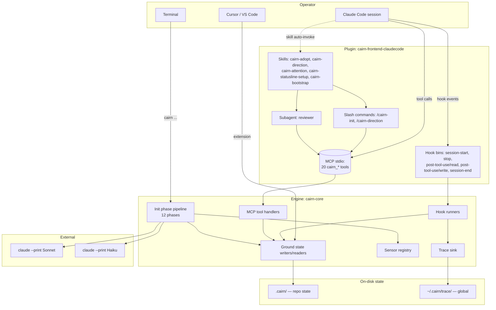
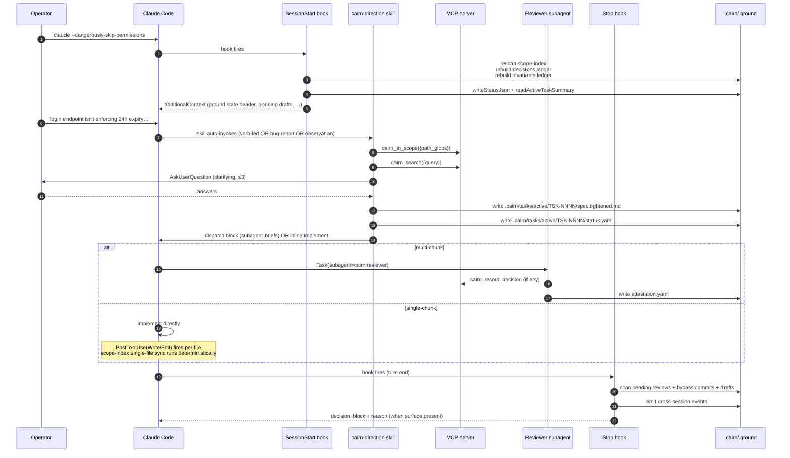

# Cairn — system overview

> **This is a technical implementation spec.** If you're trying to *use*
> Cairn rather than modify it, start with the user guide:
> [Core concepts](guide/concepts.md) and [Using Cairn day to day](guide/daily-flow.md).

End-to-end map of every surface, every flow, every state file. Reflects the
plugin-era architecture (post v0.2.0; daemon / orchestrator code purged).

---

## 1. What cairn is

Cairn = persistent ground state + context-loading layer for AI coding
agents. It curates `.cairn/ground/` (decisions, §INV invariants,
canonical-map, brand, quality-grades), exposes that state via an MCP
server, and ships a Claude Code plugin that wires adoption + the daily
flow inline.

The Claude Code plugin is the primary surface. The CLI (`cairn ...`) is
the bootstrap and debug entrypoint. There is **no separate orchestration
runtime** — the plugin uses Claude Code's built-in subagent dispatch.

---

## 2. Surfaces

| Surface | Package | Purpose |
|---------|---------|---------|
| **Plugin** | `cairn-frontend-claudecode` | Claude Code manifest + hook bins + skills + commands + the reviewer subagent. The everyday surface. |
| **MCP server** | `cairn-core/src/mcp/` | 20 tools — graph reads (`cairn_in_scope`, `cairn_invariant_get`, …), writes (`cairn_record_decision`, `cairn_resolve_attention`, `cairn_archive`), init phase tools (`cairn_init_phase_*`). |
| **CLI** | `cairn` (umbrella) | `cairn init`, `cairn join`, `cairn doctor`, `cairn scope rebuild`, `cairn trace`, `cairn hook <name>`. Bootstrap + debug. |
| **Lens** | `cairn-lens` | VS Code / Cursor extension. Resolves `§INV-NNNN` / `§DEC-NNNN` / `TODO(TSK-…)` tokens inline. Hover + decoration + CodeLens. |
| **Hook bins** | `cairn-core/src/hooks/` | Thin entrypoints called by Claude Code at hook events; delegate to runners in `hooks/runners/`. |



---

## 3. Init flow (12 phases)

Adoption is one-time. Driven by the `cairn-adopt` skill which dispatches
each phase as an MCP tool call (`cairn_init_phase_*`), surfaces operator
questions inline via `AskUserQuestion`, and threads answers into the next
call.

```mermaid
flowchart TD
  Start([operator: 'hi' in cairn-installed repo]) --> Skill[cairn-adopt skill renders<br/>'adopt? yes/not now/never']
  Skill -->|yes| P1[Phase 1 — detect<br/>JS only · stack signatures + sensor proposals]
  P1 --> P2[Phase 2 — walker<br/>JS only · git ls-files inventory]
  P2 --> P3[Phase 3 — mapper<br/>Sonnet per slice · domain + per-module proposals<br/>Haiku merge · pilot pick + summary<br/>Pre-fills globs from inferGlobsFromDetection]
  P3 --> P3b[Phase 3b — seed<br/>JS only · writes .cairn/ skeleton<br/>seeds .attested-commits with HEAD-reachable SHAs]
  P3b --> P4[Phase 4 — pilot<br/>JS only · operator confirms pilot module]
  P4 --> P5[Phase 5 — brand<br/>operator Q&A · 4 brand questions]
  P5 --> P7[Phase 7 — topic-index<br/>cross-source dedup pre-pass]
  P7 --> P8[Phase 8 — docs-ingest<br/>Haiku per doc · canonical-map topics]
  P8 --> P9[Phase 9 — source-comments<br/>Walker grabs essay blocks · Haiku batch classifies<br/>writes DEC drafts to _inbox/, INV-NNNN.md to ground/<br/>caps: 5000 files default]
  P9 --> P10[Phase 10 — rules-merge<br/>Walks CLAUDE.md/AGENTS.md · Haiku per section<br/>writes more DEC drafts]
  P10 --> P11[Phase 11 — baseline<br/>JS sensors · synthetic full-tree diff<br/>caps: 5000 files default]
  P11 --> P12[Phase 12 — strip<br/>JS only · per-module operator consent<br/>strips essay comments + inserts // §INV-NNNN<br/>folds IDs into scope-index]
  P12 --> P13[Phase 13 — multidev<br/>JS only · multi-dev enforcement seed]
  P13 --> Done([Adoption complete<br/>cairn-attention surfaces DEC drafts])

  classDef llm fill:#ff7,color:#000
  classDef det fill:#7f7,color:#000
  class P1,P2,P3b,P4,P5,P7,P11,P12,P13 det
  class P3,P8,P9,P10 llm
```



**Legend:** green = pure JS, yellow = LLM call somewhere in the phase.

---

## 4. Daily flow (operator prompt → end of turn)



---

## 5. State files — who writes, who reads

```
.cairn/
├── ground/                            ← curated knowledge
│   ├── decisions/
│   │   ├── DEC-NNNN.md                  written by: cairn_record_decision, resolve-attention(accept), Phase 8/9/10
│   │   ├── _inbox/
│   │   │   ├── DEC-NNNN.draft.md        written by: Phase 8/9/10, cairn-attention(edit)
│   │   │   └── DEC-NNNN.rejected.md     written by: resolve-attention(reject)
│   │   └── decisions.ledger.yaml        rebuilt: SessionStart, resolve-attention(accept). Read: in-scope tools, lens
│   ├── invariants/
│   │   ├── INV-NNNN.md                  written by: Phase 9 ingest
│   │   └── invariants.ledger.yaml       rebuilt: SessionStart, ingest. Read: in-scope tools, lens
│   ├── scope-index.yaml                 rebuilt: SessionStart, PostToolUse(Write/Edit), Phase 9 post-pop, Phase 10
│   ├── canonical-map/
│   │   ├── topics.yaml                  written by: Phase 8
│   │   └── citations/                   written by: Phase 8
│   ├── brand.md                         written by: Phase 5
│   └── quality-grades.yaml              written by: GC sweep
├── tasks/
│   ├── active/
│   │   └── TSK-…/
│   │       ├── spec.tightened.md        written by: cairn-direction (Step 3)
│   │       ├── status.yaml              written by: cairn-direction (Step 3)
│   │       └── attestation.yaml         written by: reviewer subagent (multi-chunk)
│   └── done/                            (not yet auto-populated; operator-managed today)
├── sessions/
│   └── <session-id>/
│       ├── status.json                  written by: SessionStart, Stop. Read by: statusline command
│       └── events-marker.txt            session events poll cursor
├── events/                              cross-session invalidation events (decision_accepted, etc.)
├── baseline/
│   └── sensor-audit-*.yaml              written by: Phase 11, `cairn baseline` CLI
├── backups/source/                      written by: Phase 10 strip-replace (per-file originals)
├── git-hooks/                           seeded by: Phase 3b
├── config/
│   ├── sensors.yaml                     written by: Phase 3b
│   └── ...
├── manifest.yaml                        written by: Phase 3b
├── init-state.json                      written by: each init phase (resume cursor)
└── .attested-commits                    seeded Phase 3b, appended on commit-msg hook

~/.cairn/trace/
└── trace-YYYY-MM-DD.jsonl               written by: every hook + MCP tool + claude --print subprocess
```

---

## 6. Hooks (when each fires, what it does)

| Hook | Fires when | Effect |
|------|-----------|--------|
| `SessionStart` | Claude Code session opens | Builds `additionalContext` (ground state summary, pending drafts, bypass count). Refreshes `status.json`. **Rebuilds:** scope-index (rescan source citations), decisions ledger, invariants ledger. GCs stale sessions + events. Syncs statusline shim. |
| `PostToolUse(Read)` | Agent reads a file | Scans content for `§INV-`/`§DEC-`/`TODO(TSK-…)` cite tokens. Builds the `┌─ cairn citations ─┐` legend block, prepended via Shape-B `additionalContext`. |
| `PostToolUse(Write\|Edit)` | Agent writes a file | Two passes: (a) copy-safety scan if file is in `copy-safety` globs; (b) **deterministic scope-index sync** for the just-written content. Both surfaced via Shape-B; never blocks the write. |
| `Stop` | End of every assistant turn | Scans pending reviews, bypass commits, draft inbox. Emits cross-session events marker. Returns `decision: block + reason` when a surface is present (Claude sees the hint inline). |
| `SessionEnd` | Session closes | Cleans the per-session dir. |
| `commit-msg` (git hook) | `git commit` runs | Appends commit SHA to `.attested-commits`. `--no-verify` bypasses; bypass-detection picks it up next SessionStart. |

**Hook bins NOT used:** `PreToolUse` is forbidden (bricks the session — durable lesson from earlier rounds).

---

## 7. Skills (auto-invoke gates)

| Skill | When it engages | What it does |
|-------|-----------------|--------------|
| `cairn-adopt` | First operator message in cairn-installed repo with no `.cairn/` | Renders adoption prompt, dispatches the 12 init phases, drains DEC drafts via `cairn-attention`. |
| `cairn-direction` | Operator message implies a code change (verbs OR bug reports OR observations OR modal-verb requests) AND no active task is in flight | Reconnaissance via `cairn_*_in_scope` tools → ≤3 clarifying questions → writes `spec.tightened.md` + `status.yaml` → dispatches subagents OR implements inline. **Hard contract: no `Edit`/`Write`/mutating Bash on source until both files exist.** |
| `cairn-attention` | SessionStart `additionalContext` flagged pending drafts / bypass / review | Surfaces ≤4 items per `AskUserQuestion`. Edit-first flow renders draft inline + structured edit menu — no "go open the file." |
| `cairn-statusline-setup` | Explicit operator request | One-time wire of `~/.claude/settings.json` `statusLine` to the cairn bundle's `cairn status-line` command via the `.active-version-path` shim. |
| `cairn-bootstrap` | Bootstrap-required (no `core.hooksPath`) signal from MCP | Sets `core.hooksPath = .cairn/git-hooks` on the clone. |

---

## 8. LLM boundary — current state

| Site | LLM | Why it's LLM | Could it be deterministic? |
|------|-----|--------------|----------------------------|
| Phase 3 mapper per-slice | Sonnet | `domain` summary + per-module purpose require judgment | **No** — judgment + writing |
| Phase 3 mapper-merge | Haiku | Synthesizes overall `domain_summary` from per-module domains; picks pilot when multiple candidates | **Partial** — only `domain_summary` synthesis remains LLM. Pilot pick + glob union + sensor passthrough are mechanical now |
| Phase 8 docs-ingest | Haiku per doc | Canonical-map topic naming + summary | **No** — semantic naming |
| Phase 9 source-comments | Haiku per batch | Classify essay block as rationale/constraint/citation/license/other; rewrite into DEC title / INV body | **No** — classification + prose rewrite |
| Phase 10 rules-merge | Haiku per section | Semantic merge of overlapping CLAUDE.md/AGENTS.md rules | **No** — conflict detection |
| `cairn-direction` skill | Main Claude (the agent itself) | Spec tightening from loose prompt | **No** — operator-facing dialog |
| `cairn-attention` skill | Main Claude | DEC draft accept/reject/edit dialog | **No** — operator-facing dialog |
| `reviewer` subagent | Sonnet | Cross-attestation of subagent diffs | **No** — judgment |

**No longer LLM (was, isn't anymore):**
- `cairn scope rebuild` CLI — deterministic regex sweep over source citations. Was Sonnet.
- Mapper sensor proposals — sourced from Phase 1 stack detection. Was per-module Sonnet output.
- Mapper baseline globs — pre-filled by `inferGlobsFromDetection` (NestJS / Drizzle / Prisma / Rails / etc. conventions). Mapper LLM still allowed to add project-specific gaps.
- Decision extractor (`runDecisionExtractor`) — entire daemon-era Tier-1 path purged. Operator-driven DEC creation flows through `cairn-direction` + `cairn_record_decision`.
- Tier-0 prompt classifier — purged. `cairn-direction`'s `when_to_use` gate handles routing.
- Spec tightener backend module — purged. The `cairn-direction` skill IS the tightener now (main Claude does the work via AskUserQuestion).

---

## 9. Self-healing rebuilds at SessionStart

Files cairn keeps in sync deterministically every session open:

| File | Source of truth | Why rebuild |
|------|-----------------|-------------|
| `scope-index.yaml` | `§INV-`/`§DEC-` cites in source files | Operator may move citations, edit files outside Claude Code, or check out a different branch. |
| `decisions.ledger.yaml` | `decisions/*.md` frontmatter | Operator may edit a DEC frontmatter manually, or `git checkout` a branch with different DECs. |
| `invariants.ledger.yaml` | `invariants/INV-*.md` frontmatter | Same reason. |

Cost is milliseconds. No LLM, no tokens. Mid-session writes update
`scope-index.yaml` immediately via `PostToolUse(Write|Edit)` — no
staleness window.

---

## 10. What got purged in v0.2.1 (Phase H)

If you remember a thing and can't find it now, this is probably why.

**Modules deleted:**
- `cairn-core/src/tier0/` — prompt classifier (was: Tier-0 routing layer)
- `cairn-core/src/tightener/` — spec tightener backend
- `cairn-core/src/decision-capture/{extractor, prompt, schema, refinement-prompt, refinement-schema, writer, types}.ts` — Tier-1 LLM extractor + refinement pipeline. Kept only `id.ts` (monotonic ID allocator).
- `cairn-core/src/mcp/tools/append-run-note.ts` + `appendRunNoteInput` schema — `cairn_append_run_note` MCP tool that wrote to `.cairn/tasks/active/<id>/notes.md`. Daemon-era; no plugin caller.
- `cairn-core/src/context/checkpoint.ts` — `writeCheckpoint`. No callers.
- `cairn-frontend-stub/` — entire workspace package. (Earlier round.)
- `cairn-core/src/inbox.ts`, `frontend-types.ts`, `decision-capture/{capture,refinement}.ts`, several `mcp/tools/*` — orchestrator-era surfaces. (Earlier round.)

**Notes if you want any of this back:**
- **Run notes:** subagents that want to drop progress notes can write to `.cairn/tasks/active/<id>/notes.md` directly with the `Write` tool — no MCP wrapper needed. If a workflow needs an MCP tool for path-safety, ~30 LOC to bring back.
- **Tightener / tier0:** the `cairn-direction` skill replaces both. Backend modules were dead because main Claude does the routing + tightening live.
- **Decision extractor:** operator-driven creation via `cairn-direction` + `cairn_record_decision` covers the path. Auto-extraction from sessions was a daemon-era assumption.
